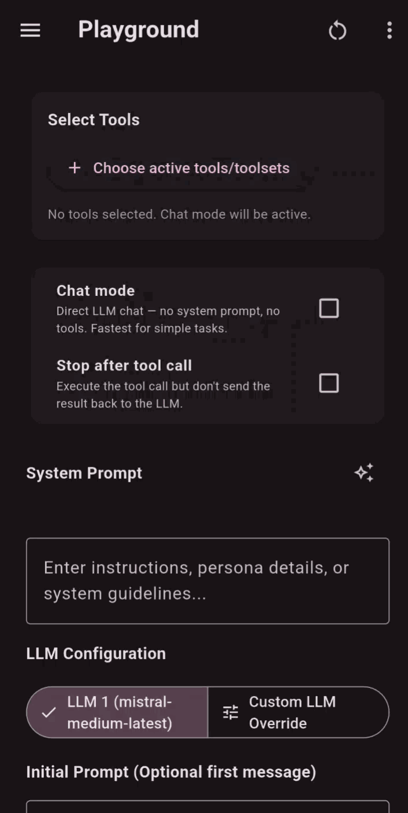

# Flutter MCP Suite Monorepo

> [!NOTE]
> This project was created and is actively maintained mostly using agentic coding tools. The core monorepo and its packages were built with **Google Antigravity IDE** (primarily powered by **Gemini 3.6 Flash**), and specific components (such as some examples) were developed using the **ZooCode** plugin with **DeepSeek-V4 Flash/Pro**. It stands as a real-world demonstration of building production-ready Dart packages and interactive Flutter libraries using agentic workflows.

Welcome to the **Flutter MCP Suite** monorepo! This project is modularized into dedicated packages spanning headless pure-Dart execution, shared UI widgets, classic AI agent chat interfaces, and dynamic generative UI rendering via Google GenUI (`A2UI`).

---

## 📦 Packages

| Package | Description | Directory |
|---|---|---|
| **[`dart_mcp_core`](dart_mcp_core)** | Pure Dart core engine. Handles agent orchestration, LLM service adapters, MCP client transport (HTTP/SSE/stdio subprocesses), and loop execution — **no Flutter dependencies**. | [`/dart_mcp_core`](dart_mcp_core) |
| **[`flutter_ui_mcp_core`](flutter_ui_mcp_core)** | Shared Flutter UI library containing reusable controllers, LLM forms, MCP server manager tabs, settings drawers, embedded model discoverers, and the side-by-side **Agent Inspector** panel. | [`/flutter_ui_mcp_core`](flutter_ui_mcp_core) |
| **[`flutter_ui_mcp`](flutter_ui_mcp)** | Classic AI Agent widget for Flutter. Drop-in interactive chat widget with markdown rendering, tool call execution, attachment support, and live inspector debugging. | [`/flutter_ui_mcp`](flutter_ui_mcp) |
| **[`flutter_genui_mcp`](flutter_genui_mcp)** | Standalone dynamic GenUI (`A2UI`) widget. Enables LLMs to emit structured UI components and render rich, interactive Flutter widgets directly in the conversation flow. | [`/flutter_genui_mcp`](flutter_genui_mcp) |

---

## 🚀 Examples

We provide several runnable example applications across Flutter, GenUI, and headless Dart:

### 🎨 GenUI (Generative UI) Examples
* **[Travel & Accommodation Planner](genui_mcp_playground/example)**: Primary showcase — interactive travel and stay planner with SerpAPI live search, date range pickers, accommodation style chips (hotels, apartments, glamping), rich photo cards, day-by-day itineraries, and JPG export.
* **[Dynamic Weather Generator](examples/genui/example_genui_weather)**: Interactive weather generator demonstrating model-generated input forms, live `fl_chart` visualizations, JPG export, and native Open-Meteo tool integrations.
* **[Smart Home & Climate Studio](examples/genui/example_genui_smarthome)**: Interactive climate controls, device toggle switches, and energy consumption bar charts.
* **[Financial Portfolio & Budget Planner](examples/genui/example_genui_finance)**: Interactive expense pie charts (`fl_chart`), savings sliders, and compound interest projection curves.
* **[Data Visualizer & Query Studio](examples/genui/example_genui_data_studio)**: Executive dashboard generator with KPI metric cards, data tables, and dynamic trend charts.
* **[Filesystem Explorer](examples/genui/example_genui_filesystem)**: Interactive GenUI filesystem explorer showcasing folder tree navigation and file content inspection surfaces.

### 📱 Flutter (Classic UI) Examples
* **[Primary Showcase App](mcp_playground_flutter/example)**: A comprehensive Flutter application demonstrating the `McpPlayground` UI widget with custom SSH, Open-Meteo weather, and fl_chart tool integrations.
* **[Device & Network Diagnostics Copilot](examples/flutter/example_device_diagnostics)**: Telemetry monitor with custom chat cards for battery, memory, CPU load, and network latency pings.
* **[Meeting Notes & Action Items Assistant](examples/flutter/example_audio_notes)**: Transcript processor with interactive action item checklist cards and markdown export.
* **[GitHub Issue Triage & PR Review Copilot](examples/flutter/example_github_triage)**: GitHub issue triage assistant with auto-labeling and inline PR code reviews.
* **[Embedded LLM Showcase](examples/flutter/example_embedded)**: A Flutter application pre-configured to run with a local on-device embedded LLM (`llamadart`) with zero external network dependencies.

### 💻 Dart (Headless) Examples
* **[Git Staged Diff Reviewer & PR Generator](examples/dart/git_review_skill)**: Automated git inspection workflow analyzing staged diffs with `dart analyze` and exporting `PR_REVIEW.md`.
* **[API Endpoint Health & Schema Prober](examples/dart/api_tester_skill)**: REST health-checking agent benchmarking endpoint latency and producing `API_DIAGNOSTICS.md`.
* **[SQLite Database Analyst & Executive Reporter](examples/dart/sqlite_analyst_skill)**: Database exploration agent introspecting schemas, executing SQL queries, and exporting `DATABASE_REPORT.md`.
* **[Skill Importer Example](examples/dart/skill_example)**: Demonstrates importing an agentskills.io-compatible [`skill.md`](examples/dart/skill_example/skill.md) with multi-turn prompts, executing a web search + HTML chart generation workflow via `McpAgentEngine`.
* **[Local Filesystem Inspector](examples/dart/local_filesystem_example)**: A headless agent configured to install and run the official `@modelcontextprotocol/server-filesystem` Node.js server via NPX to inspect and sort local files.
  
  

* **[Interactive CLI Chat Agent](examples/dart/cli_example)**: An interactive command-line interface loaded dynamically via configurations, allowing you to have a multi-turn chat conversation with LLMs using local Node/Python subprocess MCP tools.

  

* **[Embedded Model Runner](examples/dart/embedded_example)**: A pure Dart console example that downloads a `Qwen2.5-3B` GGUF model directly from Hugging Face with real-time download progress, initializes `llamadart`, registers native weather tools, and runs an offline agent with real-time token-by-token streaming.

---

## 💡 Example Prompts & System Prompts for UI Showcases

Quick prompts to copy-paste and test the interactive tools and widgets in the new UI examples:

| Example Application | Category | Try Asking / Prompting |
| :--- | :--- | :--- |
| **[Smart Home Studio](examples/genui/example_genui_smarthome)** | GenUI | `"Check current home climate status and show an interactive thermostat for the Living Room."` `"Show all lights and switches with interactive toggles so I can adjust them."` `"Analyze daily energy consumption and render a room-by-room bar chart."` |
| **[Finance & Budget Planner](examples/genui/example_genui_finance)** | GenUI | `"Break down my monthly expenses and display an interactive category pie chart."` `"Give me budget adjustment sliders to calculate projected annual savings."` `"Simulate compound growth if I invest $500/month at 8% annual return over 10 years."` |
| **[Data Visualizer Studio](examples/genui/example_genui_data_studio)** | GenUI | `"Load our quarterly sales dataset and show executive KPI cards for MRR, Churn, and ARPU."` `"Display top enterprise accounts in an interactive data table."` `"Plot monthly revenue growth over the past 12 months as a smooth curve chart."` |
| **[Device Diagnostics Copilot](examples/flutter/example_device_diagnostics)** | Flutter MCP | `"Inspect my device telemetry, CPU cores, and memory allocation."` `"Ping 1.1.1.1 and 8.8.8.8 to benchmark my network latency."` `"Perform a complete system audit and export a diagnostic summary report."` |
| **[Audio & Meeting Notes](examples/flutter/example_audio_notes)** | Flutter MCP | `"Load the latest team sync transcript and summarize key discussion points."` `"Extract all action items from the meeting with owners, priorities, and deadlines."` `"Compile executive meeting minutes and export the notes to markdown."` |
| **[GitHub Issue Triage](examples/flutter/example_github_triage)** | Flutter MCP | `"Fetch and list open repository issues currently awaiting triage."` `"Triage issue #42: classify severity, suggest labels, and assign a priority level."` `"Draft a structured pull request code review with inline suggestions."` |

> 💡 **Tip after running (`flutter run -d windows` / `-d chrome`)**:
> Each example project folder includes a pre-configured `skill.md` (AgentSkills.io standard) defining its workflow, system prompt, and tools. After launching the app, you can simply click **Skills** &rarr; **Import Skill** and select `skill.md` to automatically load the tailored system prompt and enable the required tools — or manually verify that the custom tools are checked in the **Tools** drawer / panel and paste the example prompts below.

## 🎥 Demo Videos & Visuals

### 🏖️ GenUI Travel & Stay Planner

### 💻 Flutter SSH & Terminal Tasks

